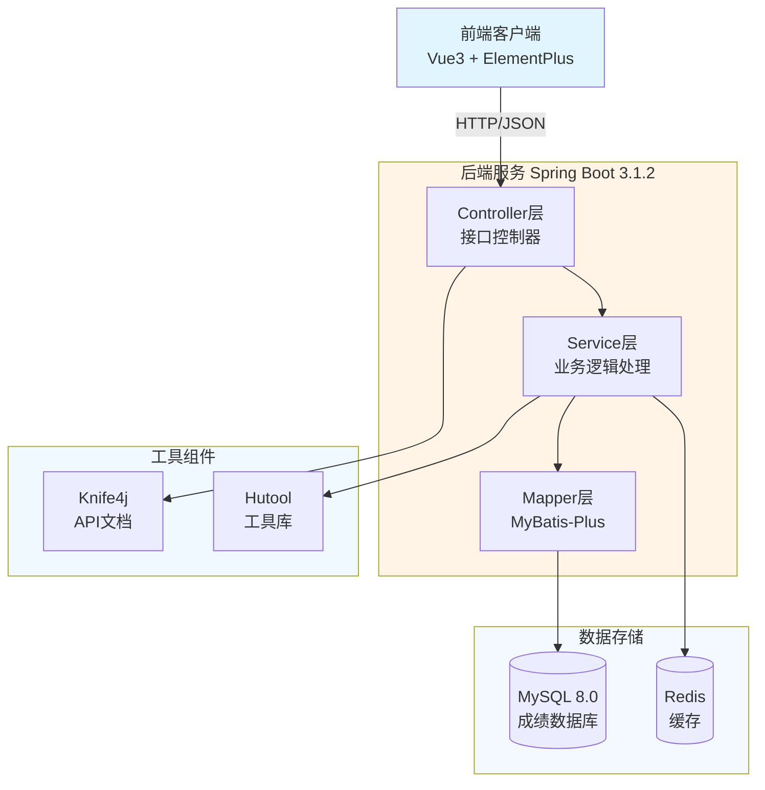

# JOSP-ExaminationSystemJava - 考研成绩查询系统后台


> 上交2023考研数据为核心开发的成绩查询系统后台

## 📖 项目简介

JOSP-ExaminationSystemJava 是一个基于 Spring Boot 3 的考研成绩查询系统后端服务,提供成绩查询、数据管理等功能。本项目不涉及个人信息,所有数据来自公开数据源,仅作技术交流和考研同学参考。

**前端项目**: [JOSP-ExaminationSystemVue3](../JOSP-ExaminationSystemVue3)

## 🏗️ 系统架构



## 🛠️ 技术栈

| 技术 | 版本 | 说明 |
|------|------|------|
| **Spring Boot** | 3.1.2 | 核心框架 |
| **Java** | 17 | 开发语言 |
| **MyBatis-Plus** | 3.5.7 | ORM框架 |
| **MySQL** | 8.0.33 | 数据库 |
| **Knife4j** | 3.0.3 | API文档 |
| **Hutool** | 5.8.21 | 工具库 |
| **Fastjson2** | 2.0.25 | JSON处理 |
| **Spring WebFlux** | - | 响应式Web |

## 📦 核心依赖

### Web层
- `spring-boot-starter-web` - Web开发
- `spring-boot-starter-webflux` - 响应式Web
- `spring-boot-starter-web-services` - Web服务

### 数据层
- `mybatis-plus-spring-boot3-starter` - MyBatis增强
- `mybatis-plus-generator` - 代码生成器
- `mysql-connector-java` - MySQL驱动

### 工具层
- `lombok` - 简化代码
- `hutool-all` - 工具集
- `fastjson2` - JSON处理
- `commons-fileupload` - 文件上传

## 🚀 快速开始

### 环境要求
- JDK 17+
- Maven 3.6+
- MySQL 8.0+
- Node.js 22+ (前端项目)

### 安装步骤

1. **克隆项目**
```bash
git clone https://github.com/your-username/JOSP-ExaminationSystemJava.git
cd JOSP-ExaminationSystemJava
```

2. **配置数据库**
```bash
# 创建数据库
CREATE DATABASE examination_system;

# 导入SQL脚本(如果存在)
mysql -u root -p examination_system < db/examination_system.sql
```

3. **修改配置**
```yaml
# application.yml
spring:
  datasource:
    url: jdbc:mysql://localhost:3306/examination_system
    username: root
    password: your_password
```

4. **运行项目**
```bash
mvn clean install
mvn spring-boot:run
```

5. **访问服务**
- 后端地址: http://localhost:8088
- API文档: http://localhost:8088/doc.html

## 📁 项目结构

```
JOSP-ExaminationSystemJava/
├── src/main/java/
│   └── wo1261931780/
│       ├── controller/          # 控制器层
│       ├── service/             # 业务逻辑层
│       ├── mapper/              # 数据访问层
│       ├── entity/              # 实体类
│       ├── config/              # 配置类
│       └── utils/               # 工具类
├── src/main/resources/
│   ├── application.yml          # 主配置文件
│   └── mapper/                  # MyBatis映射文件
└── pom.xml                      # Maven依赖配置
```

## 🔌 API文档

启动项目后访问 Knife4j 接口文档:
- 地址: http://localhost:8088/doc.html
- 功能: 在线接口测试、API文档查看

## 🔧 开发指南

### 代码生成
使用 MyBatis-Plus Generator 自动生成实体、Mapper、Service 代码:
```java
// 运行代码生成器
mvn mybatis-plus:generate
```

### 数据库迁移
如需修改数据库结构,请同步更新:
1. 实体类 (Entity)
2. Mapper接口
3. Mapper XML文件
4. 数据库SQL脚本

## 📝 更新日志

### v0.0.1-SNAPSHOT
- 初始化项目结构
- 集成Spring Boot 3.1.2
- 配置MyBatis-Plus 3.5.7
- 添加Knife4j接口文档

## 🤝 贡献指南

欢迎提交 Issue 和 Pull Request!

## 📄 许可证

本项目采用 MIT 许可证 - 查看 [LICENSE](LICENSE) 文件了解详情

## 📮 联系方式

- 作者: junw
- Email: wo1261931780@gmail.com
- GitHub: [@wo1261931780](https://github.com/wo1261931780)

## 🙏 致谢

感谢所有开源项目和贡献者的支持!

---

**注意**: 本项目仅用于技术学习和交流,不得用于商业用途。所有数据均来自公开渠道,如涉及违规请自行删除。
