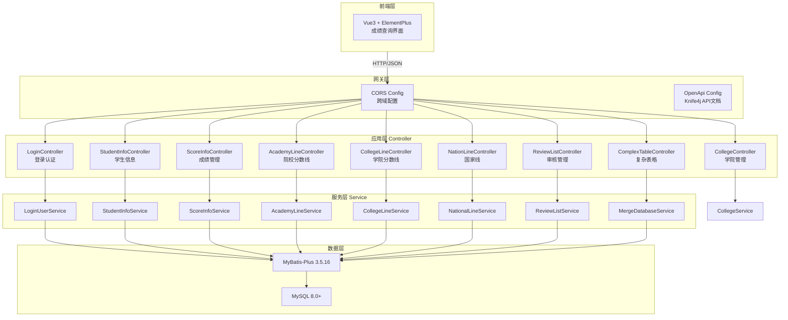
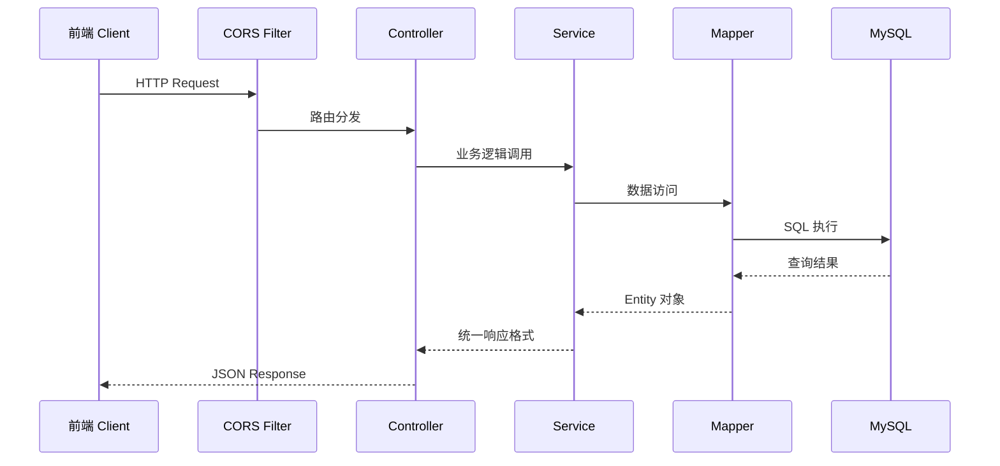
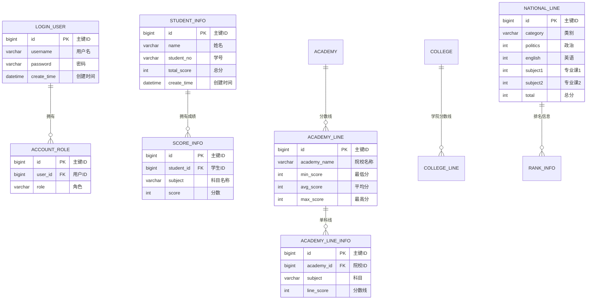

# JOSP-ExaminationSystemJava - 考研成绩查询系统

## 项目简介

JOSP-ExaminationSystemJava 是一个基于 Spring Boot 3 的考研成绩查询系统后端服务，提供考研成绩查询、数据管理、分数线分析等功能。本项目不涉及个人信息，所有数据来自公开数据源，仅作技术交流和考研同学参考。

**前端项目**: [JOSP-ExaminationSystemVue3](https://github.com/wo1261931780/JOSP-ExaminationSystemVue3)

---

## 系统架构图

### 整体架构


```mermaid
graph TB
    subgraph Frontend["前端层"]
        Vue3["Vue3 + ElementPlus<br/>成绩查询界面"]
    end

    subgraph Gateway["网关层"]
        Cors["CORS Config<br/>跨域配置"]
        OpenApi["OpenApi Config<br/>Knife4j API文档"]
    end

    subgraph Application["应用层 Controller"]
        Login["LoginController<br/>登录认证"]
        Student["StudentInfoController<br/>学生信息"]
        Score["ScoreInfoController<br/>成绩管理"]
        AcademyLine["AcademyLineController<br/>院校分数线"]
        College["CollegeController<br/>学院管理"]
        CollegeLine["CollegeLineController<br/>学院分数线"]
        Nation["NationLineController<br/>国家线"]
        Review["ReviewListController<br/>审核管理"]
        Complex["ComplexTableController<br/>复杂表格"]
    end

    subgraph Service["服务层 Service"]
        LoginUserService["LoginUserService"]
        StudentInfoService["StudentInfoService"]
        ScoreInfoService["ScoreInfoService"]
        AcademyLineService["AcademyLineService"]
        CollegeLineService["CollegeLineService"]
        NationalLineService["NationalLineService"]
        ReviewListService["ReviewListService"]
        MergeDatabaseService["MergeDatabaseService"]
    end

    subgraph Data["数据层"]
        MyBatisPlus["MyBatis-Plus 3.5.16"]
        MySQL["MySQL 8.0+"]
    end

    Frontend -->|HTTP/JSON| Cors
    Cors --> Login
    Cors --> Student
    Cors --> Score
    Cors --> AcademyLine
    Cors --> College
    Cors --> CollegeLine
    Cors --> Nation
    Cors --> Review
    Cors --> Complex

    Login --> LoginUserService
    Student --> StudentInfoService
    Score --> ScoreInfoService
    AcademyLine --> AcademyLineService
    College --> CollegeService
    CollegeLine --> CollegeLineService
    Nation --> NationalLineService
    Review --> ReviewListService
    Complex --> MergeDatabaseService

    LoginUserService --> MyBatisPlus
    StudentInfoService --> MyBatisPlus
    ScoreInfoService --> MyBatisPlus
    AcademyLineService --> MyBatisPlus
    CollegeLineService --> MyBatisPlus
    NationalLineService --> MyBatisPlus
    ReviewListService --> MyBatisPlus
    MergeDatabaseService --> MyBatisPlus

    MyBatisPlus --> MySQL
```

### 请求处理流程


```mermaid
sequenceDiagram
    participant Client as 前端 Client
    participant Cors as CORS Filter
    participant Controller as Controller
    participant Service as Service
    participant Mapper as Mapper
    participant DB as MySQL

    Client->>Cors: HTTP Request
    Cors->>Controller: 路由分发
    Controller->>Service: 业务逻辑调用
    Service->>Mapper: 数据访问
    Mapper->>DB: SQL 执行
    DB-->>Mapper: 查询结果
    Mapper-->>Service: Entity 对象
    Service-->>Controller: 统一响应格式
    Controller-->>Client: JSON Response
```

### 数据库 ER 图（核心实体）


```mermaid
erDiagram
    LOGIN_USER ||--o{ ACCOUNT_ROLE : "拥有"
    STUDENT_INFO ||--o{ SCORE_INFO : "拥有成绩"
    ACADEMY ||--o{ ACADEMY_LINE : "分数线"
    ACADEMY_LINE ||--o{ ACADEMY_LINE_INFO : "单科线"
    COLLEGE ||--o{ COLLEGE_LINE : "学院分数线"
    NATIONAL_LINE ||--o{ RANK_INFO : "排名信息"

    LOGIN_USER {
        bigint id PK "主键ID"
        varchar username "用户名"
        varchar password "密码"
        datetime create_time "创建时间"
    }

    ACCOUNT_ROLE {
        bigint id PK "主键ID"
        bigint user_id FK "用户ID"
        varchar role "角色"
    }

    STUDENT_INFO {
        bigint id PK "主键ID"
        varchar name "姓名"
        varchar student_no "学号"
        int total_score "总分"
        datetime create_time "创建时间"
    }

    SCORE_INFO {
        bigint id PK "主键ID"
        bigint student_id FK "学生ID"
        varchar subject "科目名称"
        int score "分数"
    }

    ACADEMY_LINE {
        bigint id PK "主键ID"
        varchar academy_name "院校名称"
        int min_score "最低分"
        int avg_score "平均分"
        int max_score "最高分"
    }

    ACADEMY_LINE_INFO {
        bigint id PK "主键ID"
        bigint academy_id FK "院校ID"
        varchar subject "科目"
        int line_score "分数线"
    }

    NATIONAL_LINE {
        bigint id PK "主键ID"
        varchar category "类别"
        int politics "政治"
        int english "英语"
        int subject1 "专业课1"
        int subject2 "专业课2"
        int total "总分"
    }
```

---

## 技术栈

| 分类 | 技术 | 版本 | 说明 |
|------|------|------|------|
| 核心框架 | Spring Boot | 3.5.3 | 后端核心框架 |
| 开发语言 | Java | 25 | JDK 版本要求 |
| ORM 框架 | MyBatis-Plus | 3.5.16 | 数据库访问增强 |
| 数据库 | MySQL | 8.0+ | 关系型数据库 |
| API 文档 | Knife4j | 4.5.0 | OpenAPI 3 接口文档 |
| 工具库 | Hutool | 5.8.41 | Java 工具集 |
| JSON 处理 | Fastjson2 | 2.0.61 | 高性能 JSON 解析 |
| 代码简化 | Lombok | 1.18.38 | 简化 Java 代码 |
| 模板引擎 | Velocity | 2.4.1 | 代码生成器模板 |
| 文件上传 | Commons-FileUpload | 1.6.0 | 文件上传组件 |
| 构建工具 | Maven | 3.6+ | 项目构建管理 |

---

## 功能说明

### 1. 成绩查询模块

| 功能 | 说明 |
|------|------|
| 学生成绩查询 | 根据学生信息查询各科成绩及总分 |
| 成绩备份 | 支持成绩数据备份与恢复 |
| 成绩排名 | 提供成绩排名分析功能 |
| 综合成绩生成 | 自动计算院校综合成绩 |

### 2. 院校管理模块

| 功能 | 说明 |
|------|------|
| 院校信息管理 | 院校基本信息的增删改查 |
| 院校分数线 | 院校整体分数线查询 |
| 院校单科线 | 各科目单独分数线管理 |
| 院校成绩信息 | 院校考生成绩汇总 |

### 3. 分数线管理模块

| 功能 | 说明 |
|------|------|
| 国家线管理 | 管理考研国家线数据 |
| 院校线管理 | 管理各院校复试分数线 |
| 学院线管理 | 管理各学院专业分数线 |

### 4. 审核管理模块

| 功能 | 说明 |
|------|------|
| 审核列表管理 | 考生信息审核流程管理 |
| 马克思主义审核 | 特定类别考生审核 |
| 全部审核查询 | 支持多维度审核查询 |

### 5. 用户管理模块

| 功能 | 说明 |
|------|------|
| 登录认证 | 用户登录验证 |
| 账户角色 | 支持多角色权限管理 |

### 6. 数据管理模块

| 功能 | 说明 |
|------|------|
| 数据库合并 | 多数据源合并管理 |
| 复杂表格处理 | 多维度数据表格管理 |

---

## 项目结构

```
src/main/java/wo1261931780/JOSPexaminationSystemJava/
├── JospExaminationSystemJavaApplication.java   # Spring Boot 启动类
│
├── config/                                      # 配置类
│   ├── CorsConfig.java                          # 跨域请求配置
│   ├── GlobalExceptionHandler.java              # 全局异常处理器
│   ├── MyMetaObjectHandler.java                 # MyBatis 自动填充处理器
│   ├── MybatisPlusConfig.java                   # MyBatis-Plus 配置类
│   ├── OpenApiConfig.java                       # OpenAPI/Knife4j 配置
│   └── ShowResult.java                          # 统一响应封装类
│
├── controller/                                  # 控制器层（11个Controller）
│   ├── AcademyGenerateScoreController.java      # 院校综合成绩生成
│   ├── AcademyLineController.java               # 院校分数线管理
│   ├── AcademySubjectListController.java        # 院校科目列表
│   ├── CollegeController.java                   # 学院信息管理
│   ├── CollegeLineController.java               # 学院分数线管理
│   ├── ComplexTableController.java             # 复杂表格管理
│   ├── LoginController.java                     # 登录认证
│   ├── NationLineController.java                # 国家线管理
│   ├── ReviewListAllController.java             # 审核列表（全部）
│   ├── ReviewListMarxismController.java         # 审核列表（马克思主义）
│   └── StudentInfoController.java               # 学生信息管理
│
├── service/                                     # 业务逻辑层（15个Service）
│   ├── AcademyGenerateScoreService.java
│   ├── AcademyLineInfoService.java
│   ├── AcademyLineService.java
│   ├── AcademyScoreInfoService.java
│   ├── CollegeLineService.java
│   ├── CollegeService.java
│   ├── ComplexTableService.java
│   ├── LoginUserService.java
│   ├── MergeDatabaseService.java
│   ├── NationalLineService.java
│   ├── RankInfoService.java
│   ├── ReviewListService.java
│   ├── ScoreBakcupService.java
│   ├── ScoreInfoService.java
│   └── StudentInfoService.java
│
├── entity/                                      # 实体类（17个Entity）
│   ├── AccountRole.java                         # 账户角色
│   ├── AcademyGenerateScore.java                # 院校综合成绩
│   ├── AcademyLine.java                         # 院校分数线
│   ├── AcademyLineInfo.java                     # 院校单科线
│   ├── AcademyScoreInfo.java                    # 院校成绩信息
│   ├── AcademySingle.java                       # 院校单独数据
│   ├── College.java                             # 学院信息
│   ├── CollegeLine.java                         # 学院分数线
│   ├── ComplexTable.java                        # 复杂表格
│   ├── LoginUser.java                           # 登录用户
│   ├── MergeDatabase.java                       # 合并数据库
│   ├── NationalLine.java                        # 国家线
│   ├── RankInfo.java                            # 排名信息
│   ├── ReviewList.java                          # 审核列表
│   ├── ScoreBakcup.java                         # 成绩备份
│   ├── ScoreInfo.java                           # 成绩信息
│   └── StudentInfo.java                         # 学生信息
│
├── dao/                                         # 数据访问层（15个Mapper）
│   └── *Mapper.java                             # MyBatis-Plus Mapper 接口
│
└── DTO/                                         # 数据传输对象
    ├── AcademySubjectListDTO.java               # 院校科目列表DTO
    └── StudentListDTO.java                       # 学生列表DTO
```

---

## 数据库表

| 表名 | 说明 |
|------|------|
| `login_user` | 登录用户信息 |
| `account_role` | 账户角色关联 |
| `student_info` | 学生基本信息 |
| `score_info` | 成绩详细信息 |
| `score_backup` | 成绩数据备份 |
| `academy_line` | 院校分数线 |
| `academy_line_info` | 院校单科分数线 |
| `academy_score_info` | 院校成绩信息 |
| `academy_single` | 院校单独招生数据 |
| `academy_generate_score` | 院校综合成绩 |
| `college` | 学院信息 |
| `college_line` | 学院分数线 |
| `complex_table` | 复杂表格数据 |
| `national_line` | 国家线数据 |
| `rank_info` | 排名信息 |
| `review_list` | 审核列表 |
| `merge_database` | 数据库合并记录 |

---

## 使用说明

### 环境要求

| 环境 | 版本要求 |
|------|----------|
| JDK | 25+ |
| Maven | 3.6+ |
| MySQL | 8.0+ |
| Node.js | 22+（前端项目需要） |

### 安装步骤

**1. 克隆项目**

```bash
git clone https://github.com/wo1261931780/JOSP-ExaminationSystemJava.git
cd JOSP-ExaminationSystemJava
```

**2. 配置数据库**

```bash
# 登录 MySQL
mysql -u root -p

# 创建数据库
CREATE DATABASE postgraduate CHARACTER SET utf8mb4 COLLATE utf8mb4_unicode_ci;
```

**3. 修改配置文件**

编辑 `src/main/resources/application.yml`，修改数据库连接信息：

```yaml
spring:
  datasource:
    url: jdbc:mysql://localhost:3306/postgraduate?useSSL=false&useUnicode=true&serverTimezone=Asia/Shanghai&characterEncoding=utf8&zeroDateTimeBehavior=convertToNull&allowPublicKeyRetrieval=true&allowMultiQueries=true
    username: root
    password: your_password
    driver-class-name: com.mysql.cj.jdbc.Driver
  jackson:
    date-format: yyyy-MM-dd HH:mm:ss

server:
  port: 8081

mybatis-plus:
  configuration:
    log-impl: org.apache.ibatis.logging.stdout.StdOutImpl
    map-underscore-to-camel-case: true
  global-config:
    db-config:
      id-type: assign_id
```

**4. 编译运行**

```bash
# 编译项目
mvn compile

# 启动服务
mvn spring-boot:run

# 或打包后运行
mvn package -DskipTests
java -jar target/JOSP-ExaminationSystemJava-0.0.1-SNAPSHOT.jar
```

**5. 访问 API 文档**

服务启动后，访问以下地址查看 API 文档：

| 文档工具 | 访问地址 |
|----------|----------|
| Swagger UI | http://localhost:8081/swagger-ui/index.html |
| Knife4j | http://localhost:8081/doc.html |

---

## 部署说明

### 开发环境部署

```bash
# 1. 确保 MySQL 服务运行
mysql -u root -p

# 2. 导入初始数据（如有 SQL 脚本）
# mysql -u root -p postgraduate < init.sql

# 3. 运行项目
mvn spring-boot:run
```

### 生产环境部署

**1. 构建可执行 JAR**

```bash
mvn clean package -DskipTests
```

**2. 使用 systemd 部署**

创建服务文件 `/etc/systemd/system/josp.service`：

```ini
[Unit]
Description=JOSP Examination System
After=network.target mysql.service

[Service]
Type=simple
User=your_user
WorkingDirectory=/path/to/JOSP-ExaminationSystemJava
ExecStart=/usr/bin/java -jar JOSP-ExaminationSystemJava-0.0.1-SNAPSHOT.jar
Restart=always

[Install]
WantedBy=multi-user.target
```

**3. 启动服务**

```bash
sudo systemctl daemon-reload
sudo systemctl enable josp
sudo systemctl start josp
```

### Docker 部署（可选）

```dockerfile
FROM eclipse-temurin:25-jre
COPY target/JOSP-ExaminationSystemJava-0.0.1-SNAPSHOT.jar /app/app.jar
WORKDIR /app
EXPOSE 8081
ENTRYPOINT ["java", "-jar", "app.jar"]
```

构建并运行：
```bash
docker build -t josp-examination .
docker run -d -p 8081:8081 --name josp josp-examination
```

---

## 主要 API 接口

### 登录认证

| 接口 | 方法 | 说明 |
|------|------|------|
| `/login` | POST | 用户登录 |

### 学生信息

| 接口 | 方法 | 说明 |
|------|------|------|
| `/student/list` | GET | 学生列表查询 |
| `/student/{id}` | GET | 学生信息详情 |
| `/student/add` | POST | 添加学生 |
| `/student/update` | PUT | 更新学生信息 |
| `/student/delete` | DELETE | 删除学生 |

### 成绩管理

| 接口 | 方法 | 说明 |
|------|------|------|
| `/score/list` | GET | 成绩列表查询 |
| `/score/{id}` | GET | 成绩详情 |
| `/score/add` | POST | 添加成绩 |
| `/score/backup` | POST | 成绩备份 |

### 院校管理

| 接口 | 方法 | 说明 |
|------|------|------|
| `/academy/line/list` | GET | 院校分数线列表 |
| `/academy/line/{id}` | GET | 院校分数线详情 |
| `/academy/subject/list` | GET | 院校科目列表 |
| `/academy/score/generate` | POST | 生成综合成绩 |

### 分数线

| 接口 | 方法 | 说明 |
|------|------|------|
| `/national/line/list` | GET | 国家线列表 |
| `/college/line/list` | GET | 学院分数线列表 |

### 审核管理

| 接口 | 方法 | 说明 |
|------|------|------|
| `/review/list/all` | GET | 全部审核列表 |
| `/review/list/marxism` | GET | 马克思主义审核列表 |

---

## 配置说明

### MyBatis-Plus 配置

```yaml
mybatis-plus:
  mapper-locations: classpath*:wo1261931780/JOSPexaminationSystemJava/DAO/*Mapper.xml
  type-aliases-package: wo1261931780.JOSPexaminationSystemJava.entity
  configuration:
    map-underscore-to-camel-case: true
    log-impl: org.apache.ibatis.logging.stdout.StdOutImpl
  global-config:
    db-config:
      id-type: assign_id
      logic-delete-field: deleted
      logic-delete-value: 1
      logic-not-delete-value: 0
```

### 服务器配置

```yaml
server:
  port: 8081
  servlet:
    context-path: /
```

---

## 前端项目对接

本后端服务需要配合前端项目使用：

**前端项目地址**: [JOSP-ExaminationSystemVue3](https://github.com/wo1261931780/JOSP-ExaminationSystemVue3)

前端需要安装并配置：

```bash
# 克隆前端项目
git clone https://github.com/wo1261931780/JOSP-ExaminationSystemVue3.git
cd JOSP-ExaminationSystemVue3

# 安装依赖
npm install

# 配置后端接口地址（.env 文件）
VITE_API_BASE_URL=http://localhost:8081

# 启动开发服务器
npm run dev
```

---

## 常见问题

**Q: 启动报错 "Unable to connect to database"**

A: 检查 `application.yml` 中的数据库连接信息是否正确，确保 MySQL 服务已启动。

**Q: JDK 版本不匹配**

A: 确保使用 JDK 25+，可在命令行执行 `java -version` 确认版本。

**Q: 前端无法访问 API**

A: 检查 CORS 配置，确保后端已允许前端域名跨域访问。

---

## 许可证

本项目采用 [AGPL-3.0](./LICENSE) 开源许可证。

---

**注意**: 本项目仅用于技术学习和交流，不得用于商业用途。所有数据均来自公开渠道，如涉及违规请自行删除。